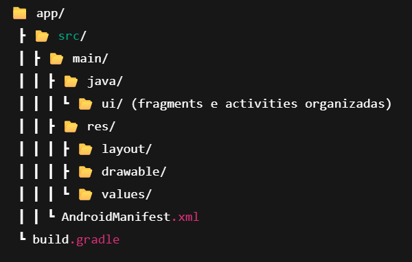

# 📱 Plataforma Profissional Anônima

Este projeto é uma aplicação Android desenvolvida como parte do **Challenge 2025 da FIAP**, no contexto da **Sociedade 5.0**. A proposta é criar uma solução que faça a diferença na sociedade. Com isso, desenvolvemos a plataforma anônima profissional**, onde usuários podem se conectar, compartilhar experiências, buscar suporte e desenvolver sua carreira em um ambiente seguro e livre de julgamentos.


## 🚀 Funcionalidades

- 🔒 **Acesso com login e criação de conta**
- 🗣️ **Chat anônimo entre profissionais**
- 🧑‍💼 **Matchmaking profissional** (conexões baseadas em interesses e áreas de atuação)
- 💬 **Fórum colaborativo**
- 📰 **Feed de conteúdo profissional**
- 👤 **Perfil com informações profissionais (não públicas)**
- 👩‍💻 **Suporte ao usuário**

### Pré-requisitos 📦

- Android Studio (recomendado: versão mais recente)
- SDK Android API 31+
- Emulador Android ou dispositivo físico com Android 8.0 (Oreo) ou superior

  ### Passos

1. Clone o repositório:

   ```bash
   git clone https://github.com/seu-usuario/Plataforma-Profissional-Anonima.git 
   
2. Abra o projeto no Android Studio:
  File > Open > selecione a pasta do projeto
3. Aguarde o Gradle sincronizar.
4. Conecte um dispositivo Android ou inicie um emulador.
5. Clique em Run 'app' ou use o atalho Shift + F10.
   
📱 Caso queria utilizar o app em seu celular, baixe a última release disponível e ative as permissões de baixar aplicativos de terceiros nas configurações de seu dispositivo Android.
⚠️ Observação: Este aplicativo só funciona em dispositivos Android. Não há suporte para execução em navegadores web ou iOS.


## 🧠 Tecnologias utilizadas
- Kotlin 
- Android Studio
- XML
- MVVM Architecture
- Git e GitHub para controle de versão

## Estrutura do projeto



## 🧑‍💻 Desenvolvido por
Projeto desenvolvido por alunos da FIAP no Challenge 2025. 
   
